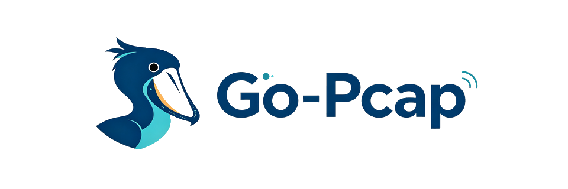
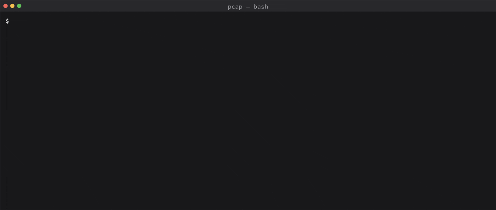

<p align="center">
  
</p>

<h1 align="center">go-pcap</h1>

<p align="center">
  <strong>Native Go Packet Capture, tcpdump-style cBPF Compilation, CGO-free Cross Builds</strong>
</p>

<p align="center">
  <a href="https://github.com/huatuo-ai/go-pcap/stargazers"></a>
  <a href="https://github.com/huatuo-ai/go-pcap/issues"></a>
  <a href="./LICENSE"></a>
  <a href="./CONTRIBUTING.md"></a>
</p>

<p align="center">
  
  
  
</p>

<p align="center">
  <a href="./README_CN.md"><strong>中文文档</strong></a> ·
  <a href="./docs/index.md"><strong>Documentation</strong></a> ·
  <a href="./examples/README.md"><strong>Examples</strong></a>
</p>

## What is go-pcap

`go-pcap` is a native Go packet-capture library and tcpdump-style cBPF filter
compiler. It provides a libpcap-like capture surface without CGO, making
`CGO_ENABLED=0` builds and cross-compilation straightforward.

The following recording shows the `pcap` CLI capturing live loopback traffic
through an L3-aware cBPF filter, printing tcpdump-compatible packet summaries:



## Why this fork

This project is derived from
[packetcap/go-pcap](https://github.com/packetcap/go-pcap) and remains licensed
under Apache-2.0. The filter compiler has been substantially reworked by the
HuaTuo team while retaining the pure-Go design:

- Compile the same filter AST for Ethernet (`EN10MB`) or raw IP (`RAW`, L3)
  packet layouts.
- Use a two-pass, label-based cBPF assembler instead of hand-calculated jump
  offsets.
- Correct `and`/`or` precedence, parenthesized negation, composite
  short-circuiting, and several L2/L3 edge cases.
- Support IPv4, IPv6, ARP/RARP, TCP, UDP, ICMP, ICMP6, IGMP, PIM, ESP, AH,
  VRRP, host, network, port, multicast, and common logical combinations.
- Provide executable Examples, VM behavior tests, tcpdump decision-equivalence
  checks when tcpdump is installed, and repeatable benchmarks.

The implemented filter language is a useful tcpdump-style subset, not a claim
of complete libpcap grammar compatibility.

## Install

```sh
go get github.com/huatuo-ai/go-pcap@latest
```

## Compile filters for Ethernet or raw IP

Use the package-level compiler when the input packet layout is known. Do not
cast a pcap/link-layer numeric value to `filter.LinkType`: choose the semantic
layout explicitly.

```go
package main

import (
	"errors"
	"log"

	"github.com/huatuo-ai/go-pcap/filter"
	"golang.org/x/net/bpf"
)

func main() {
	insns, err := filter.Compile("ip6 and udp and port 53", filter.LinkTypeRaw)
	if err != nil {
		log.Fatal(err)
	}

	raw, err := bpf.Assemble(insns)
	if err != nil {
		log.Fatal(err)
	}
	_ = raw

	_, err = filter.Compile("arp", filter.LinkTypeRaw)
	if errors.Is(err, filter.ErrL2OnlyLinkType) {
		// Choose Ethernet framing, or reject the L2-only expression.
	}
}
```

`filter.Size(expr, linkType)` returns the number of cBPF instructions that
`filter.Compile` would emit.

## Link-type behavior and errors

| Layout | Packet starts at | Supported predicates |
| --- | --- | --- |
| `filter.LinkTypeEthernet` | Ethernet header | L2 and L3 predicates |
| `filter.LinkTypeRaw` | IPv4/IPv6 header | L3 predicates only |

On `RAW`, expressions that are entirely L2-only, such as `arp`, `rarp`, or
`ether host aa:bb:cc:dd:ee:ff`, return `ErrL2OnlyLinkType` rather than silently
producing a filter with the wrong meaning. Empty expressions return
`ErrEmptyFilter`; unsupported layouts return `ErrUnsupportedLinkType`.

## Filter language

Common supported expressions include:

```text
tcp and port 443
ip6 and udp and port 53
src and dst host 192.0.2.1
ip multicast
tcp and port 80 or udp
not (tcp or udp)
```

`and` binds tighter than `or`; use parentheses when explicit grouping makes a
rule easier to read. Byte-offset predicates, protocol-number literals, port
ranges, VLAN/MPLS encapsulation, and the full tcpdump grammar are not currently
implemented.

## Reliability: tests and benchmarks

Run the full test suite with:

```sh
make test
```

It runs unit tests, Go Examples, cBPF VM behavior tests, RAW/L2 boundary tests,
and a tcpdump/libpcap decision-equivalence suite when `tcpdump` is available.
The equivalence suite compares packet accept/reject decisions, not instruction
bytes, because libpcap optimization output can vary by version.

Run repeatable filter benchmarks with:

```sh
make bench
```

This executes parser, compiler, size, and VM match/miss benchmarks ten times
with `-benchmem`, reporting `ns/op`, `B/op`, and `allocs/op`. Compare benchmark
results only on equivalent machines and Go versions.

## CLI

Build the sample capture utility:

```sh
make build
./pcap --help
```

The CLI prints tcpdump-style packet summaries for common Ethernet, ARP, IPv4,
IPv6, TCP, UDP, and ICMP traffic. Its common display switches are compatible
with tcpdump 4.99.x: `-i`, `-c`, `-n`/`-nn`, `-q`, `-v`, `-e`,
`-X`, `-A`, `-s`, and `-p`. Use `-nn` when scripting so host and service names
remain numeric and output is deterministic.

```sh
./pcap -nn -i eth0 -c 10 'tcp port 443'
```

This is a live-capture CLI; pcap file read/write modes and the less common
tcpdump switches are not implemented.

Cross-compilation is supported through the `OS` and `ARCH` Makefile variables.
By default, the host executable is available as `./pcap` in the project
root. Target-specific artifacts are also written to the project root; set
`BINDIR` to place them elsewhere. For 32-bit Linux ARM, select the ABI level
explicitly:

```sh
make build OS=linux ARCH=arm GOARM=6 # pcap-linux-armv6
make build OS=linux ARCH=arm GOARM=7 # pcap-linux-armv7
```

An ARMv7 binary must not be deployed to an ARMv6 device. The release matrix
does not publish a soft-float ARM artifact.

## Platform support and limitations

Capture support is available for Linux and macOS/Darwin. Packet capture usually
requires the appropriate operating-system privileges. On Linux the default
capture path uses an AF_PACKET TPACKET_V3 mmap ring, so it also needs kernel
support and `CAP_NET_RAW`. On older kernels or restricted containers,
`./pcap --syscalls` bypasses the mmap/TPACKET_V3 path; it does not remove the
capture-permission requirement. `RAW` is a compiler layout for packets
beginning at an IP header; it is not a substitute for an Ethernet capture
handle and cannot evaluate L2-only predicates.

## Contributing

Issues and pull requests are welcome, especially for new protocol support,
link types, compatibility cases, and performance work. Please run `make test`
and the relevant `make bench` cases before submitting a change.

See [CONTRIBUTING.md](CONTRIBUTING.md) for local checks and pull-request
expectations. The [documentation](docs/index.md) includes deeper guides for the
[architecture](docs/concepts/architecture.md), [compiler
internals](docs/concepts/compiler-internals.md), [new filter
primitives](docs/contributing/new-primitive.md), and
[testing](docs/contributing/testing.md).

## Acknowledgments and license

The original capture library is derived from
[packetcap/go-pcap](https://github.com/packetcap/go-pcap). The L3-aware filter
compiler, label assembler, and reliability work were developed by the HuaTuo
team. See [LICENSE](LICENSE) for the Apache-2.0 license text.
